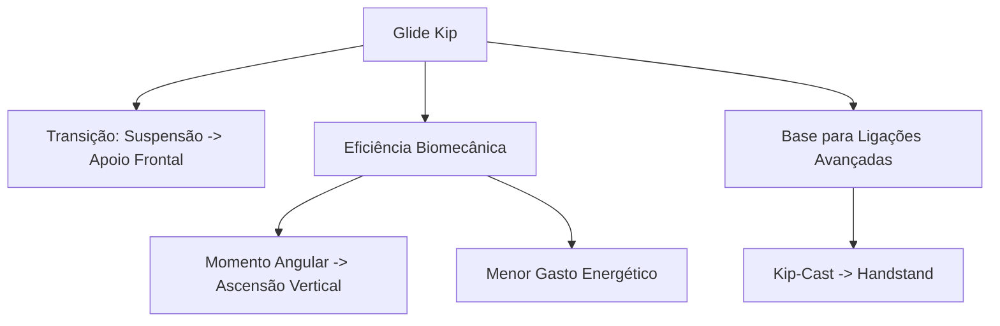
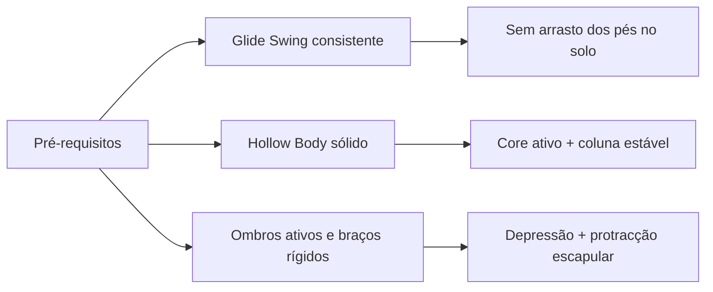
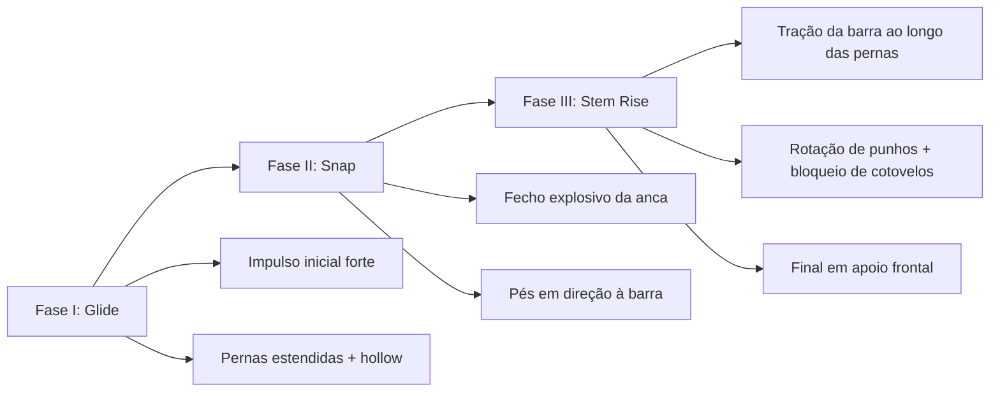
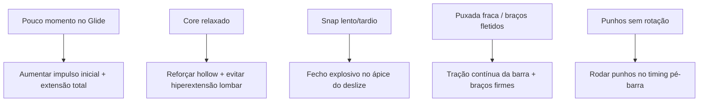

# Modelo Visual — Glide Kip

## 1) Visão Geral Estratégica

---

## 2) Pré-requisitos (Checklist Técnico)

**Regra de ouro:** sem base postural sólida, há perda de energia + aumento de risco de compensações lombares.

---

## 3) Decomposição em 3 Fases

### Relação de dependência
- **Glide curto** -> **Snap fraco** -> **Subida comprometida**.
- Fluidez entre fases = conservação da energia cinética até ao apoio.

---

## 4) Diagnóstico Rápido de Erros (Mapa de Correção)

> **Ponto crítico:** a rotação dos punhos define a passagem do centro de gravidade para cima da barra.

---

## 5) Protocolo de Progressão (15 min/dia)

```mermaid
gantt
    title Progressão Técnica do Glide Kip
    dateFormat  X
    axisFormat %s

    section Preparação
    Glide swings isolados            :a1, 0, 3
    Hollow + controlo escapular      :a2, 3, 2

    section Potência específica
    Leg lifts (solo/suspensão)       :b1, 5, 3
    Snap drills (fecho rápido)       :b2, 8, 2

    section Transferência técnica
    Rotação de punhos                :c1, 10, 2
    Candlestick roll-down            :c2, 12, 3
```

---

## 6) Painel de Monitorização (Template)

| Métrica | Escala | Meta semanal |
|---|---:|---:|
| Qualidade do Glide | 0-5 | >= 4 |
| Integridade Hollow | 0-5 | >= 4 |
| Explosividade do Snap | 0-5 | >= 4 |
| Timing da rotação de punhos | 0-5 | >= 4 |
| Finalização em apoio frontal | 0-5 | >= 4 |

### Critério de progressão
- Avançar para combinações (ex.: kip-cast) apenas quando o atleta mantiver média **>= 4** em todas as métricas por 2 semanas consecutivas.
